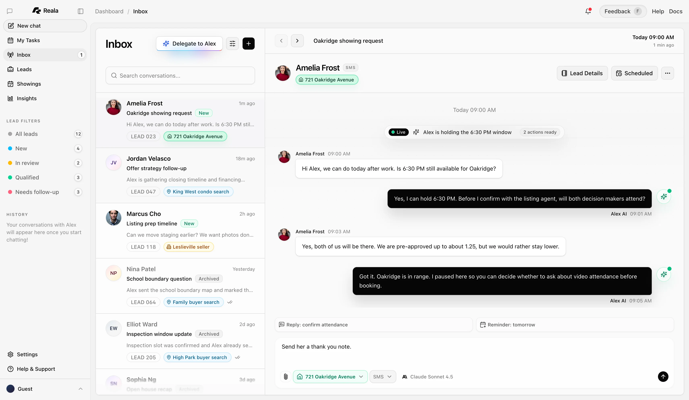
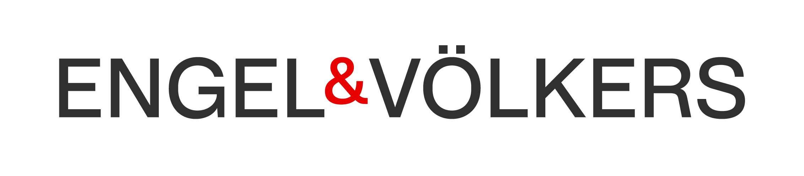

# Reala Case Study

## Summary

Reala is a real-estate operations suite built as a portfolio case study for product design, frontend engineering, and product engineering work. The monorepo presents three connected surfaces: a marketing site, an AI intake/chat workflow, and a brokerage operations portal.

## Problem

Real-estate teams operate across fragmented tools: lead capture, follow-up, showing coordination, listing operations, vendor scheduling, asset approvals, and billing often sit in separate systems. The product challenge was to make those workflows feel like one coherent operating layer without losing the nuance of brokerage teams, individual agents, vendors, and client-facing requests.

## Role

Product designer turned frontend/product engineer:

- Defined the information architecture across marketing, AI intake, and operations.
- Designed dashboard flows for repeat operational work, not just static pages.
- Implemented Next.js app surfaces with auth-aware routing and data-ready components.
- Turned ambiguous workflow needs into concrete UI states, navigation, and app structure.

## Product Surfaces

### Marketing Site

The marketing site frames Reala as an operating system for real-estate teams. It focuses on workflow clarity, integrations, trust signals, and conversion paths into the product.

### AI Intake App

The chatbot app demonstrates conversational intake, lead handling, managed agent routing, and inbox-style workflows. It is the bridge between a prospect or agent request and structured downstream work.

### Brokerage Portal

The brokerage portal is the operational command center: listings, orders, jobs, approvals, agents, vendors, service catalog, billing, and workspace access. It uses realistic brokerage branding and workflow complexity to show product-engineering depth.

## Key Product Decisions

- Treat chat as intake plus workflow routing, not a generic assistant.
- Use a dashboard structure optimized for scanning, triage, and repeated action.
- Separate marketing, chatbot, and brokerage surfaces while keeping them in one product system.
- Keep secrets, local research, generated scratch files, and internal implementation notes out of the public demo.
- Preserve realistic workflow complexity while presenting the repo as a clean portfolio artifact.

## Technical Shape

- Next.js and React across all app surfaces.
- TypeScript-first UI and application logic.
- Clerk-ready auth and organization patterns.
- Supabase/Postgres-ready data modeling and migrations.
- Workspace-based brokerage access model.
- Portfolio-safe demo assets and README documentation.

## Tradeoffs

- The repo keeps realistic operational depth, so some screens are more complex than a lightweight visual demo.
- The brokerage portal is demo-buildable without real environment secrets, while runtime database-backed workflows still require proper environment configuration.
- The monorepo intentionally prioritizes portfolio clarity over preserving every internal research artifact from earlier development.

## Outcome

The cleaned repo now reads as a coherent product suite instead of a raw working directory. It can be used to show product thinking, UI architecture, realistic workflow modeling, and hands-on frontend/product engineering execution.

## Adjacent Portfolio Work

- Aerobase / Jetlag public demo: a separate sanitized travel-platform demo was prepared from a private codebase without carrying over private git history. The public version shows cash search, award search, trip/result selection, deal and discovery boundaries, email/import architecture, jetlag score display, and recovery-plan generation with proprietary algorithms, supplier integrations, scraper code, and backend secrets replaced by deterministic fixtures/stubs. The demo copy is prepared as the separate `aerobase-public-demo` repo and has passing typecheck, tests, and production build verification.
- ChronoGuesser: a standalone portfolio case study for a historical-location guessing game that combines generated panorama production, content enrichment, catalog-driven mobile UX, and backend publication workflows. It is intentionally included as documentation only, without source code, service identifiers, generation scripts, or runnable setup, so it can communicate the product/engineering work without making the implementation portable.
- Job poster tooling: markdown-resume has been installed under the job posting workspace to support resume/profile presentation workflows.
